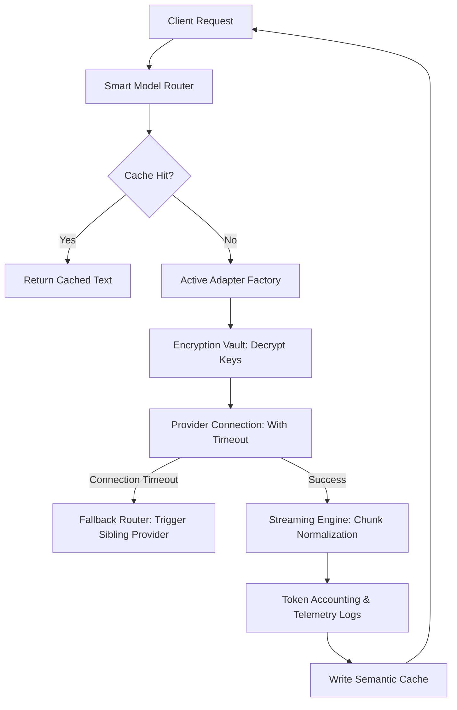

# AI Gateway Specification

This document details the architecture of the **Moataz AI Gateway**, which acts as the unified middleware proxying all prompts to external LLMs.

---

## 1. Gateway Pipeline Topology

Every LLM generation passes through a multi-stage request/response pipeline:



---

## 2. Smart Model Router

The gateway doesn't just pass models through; it routes queries dynamically based on target priorities:
*   **Routing Policies**:
    *   `cost-efficient`: Routes to lightweight models (e.g. Gemini Flash, GPT-4o-mini) for simple chats or summaries.
    *   `high-intelligence`: Routes complex tasks (e.g. coding sandbox executions) to advanced models (e.g. Claude 3.5 Sonnet, GPT-4o).
    *   `latency-optimized`: Routes to high-throughput providers (e.g. Groq, DeepSeek).
*   **Router Implementation Schema**:

```typescript
export interface IRouterPolicy {
  policyName: 'cost' | 'intelligence' | 'speed';
  maxAllowedTokens: number;
}

export class SmartModelRouter {
  static selectModel(prompt: string, policy: IRouterPolicy): { provider: string; modelName: string } {
    const complexityScore = this.evaluateComplexity(prompt);
    
    if (policy.policyName === 'cost' && complexityScore < 6) {
      return { provider: 'google', modelName: 'gemini-1.5-flash' };
    }
    
    if (complexityScore > 8) {
      return { provider: 'anthropic', modelName: 'claude-3-5-sonnet' };
    }
    
    return { provider: 'openai', modelName: 'gpt-4o' };
  }

  private static evaluateComplexity(prompt: string): number {
    // Structural logic (e.g. code keywords, prompt length, task instructions)
    let score = 3;
    if (prompt.includes('function') || prompt.includes('class')) score += 3;
    if (prompt.length > 2000) score += 2;
    return Math.min(score, 10);
  }
}
```

---

## 3. Streaming Engine & Chunk Normalization

Each AI provider returns stream events in varying JSON keys (e.g., Anthropic uses `type: "content_block_delta"`, OpenAI uses `choices[0].delta.content`).

The **Streaming Engine** normalizes these formats on the fly into a standard, unified stream format:

```json
/* Standardized Stream Chunk Schema */
{
  "chunkId": "chunk-9f7a81b2",
  "text": "Hello world",
  "finishReason": null,
  "usage": {
    "promptTokens": 12,
    "completionTokens": 2
  }
}
```

---

## 4. Resilience: Retries, Fallbacks & Timeouts

To maintain high availability (99.9% uptime), the Gateway implements strict recovery strategies:
1.  **Timeouts**: Maximum connection timeout is capped at `5000ms`. If a provider does not reply within this window, the thread aborts.
2.  **Retry Matrix**:
    *   For temporary server errors (`502 Bad Gateway`, `503 Service Unavailable`, `429 Rate Limit`), the system retries up to 3 times using **Exponential Backoff with Jitter**:
        $$\text{Delay} = 2^{\text{attempt}} \times 1000\text{ms} + \text{Random Jitter}$$
3.  **Failovers**: If retries are exhausted or the provider returns a critical outage, the Fallback Router hot-swaps to a backup provider (e.g., if Anthropic Sonnet fails, route immediately to OpenAI GPT-4o).

---

## 5. Token Accounting & Caching Layer

### Token Accounting (Usage Ledger)
Before response chunks are emitted back to the client, the Gateway passes the raw strings to a tokenizer library (like `tiktoken` for OpenAI/Anthropic or token lengths calculations for Gemini) to calculate prompt and completion counts. These counts are written directly to the usage ledger:

```sql
CREATE TABLE gateway_token_ledgers (
    id UUID PRIMARY KEY DEFAULT gen_random_uuid(),
    user_id UUID NOT NULL,
    provider VARCHAR(50) NOT NULL,
    model_name VARCHAR(100) NOT NULL,
    prompt_tokens INT NOT NULL,
    completion_tokens INT NOT NULL,
    cost_usd DECIMAL(12, 6) NOT NULL,
    created_at TIMESTAMP WITH TIME ZONE DEFAULT CURRENT_TIMESTAMP NOT NULL
);
```

### Semantic Caching (Redis)
*   **Concept**: Checks if similar semantic prompts have been answered recently (within a vector distance threshold).
*   **Execution**:
    1.  Generate an embedding of the incoming prompt.
    2.  Query Redis or Qdrant for previous prompts within $d < 0.05$ (Euclidean distance).
    3.  If a match is found, return the cached completion instantly, saving token costs and reducing latencies to <20ms.
