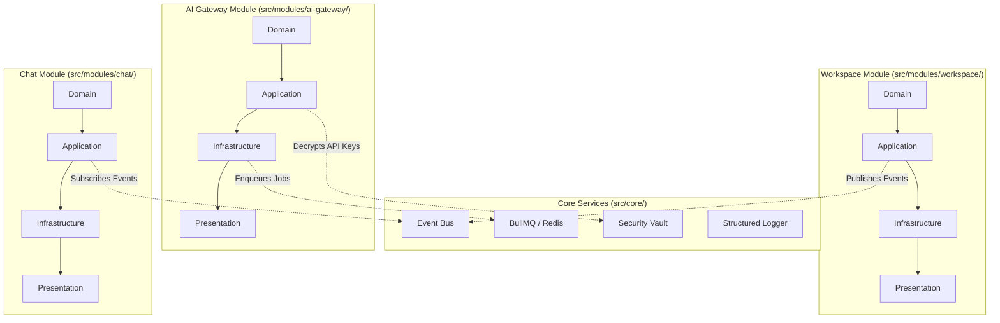

# Architecture Blueprint: Hybrid Modular Clean Architecture

This document details the high-level architecture of Moataz AI. To support a codebase exceeding 500,000 lines of code, the system combines **Clean Architecture** boundaries with **Feature-Based Modular Architecture**.

---

## 1. System Structural Model

Moataz AI divides files into three core namespaces:
1.  **Core Systems (`src/core/`)**: Cross-cutting framework concerns that service the entire application (e.g., Event Bus, Queue adapters, Encryption Vault, structured loggers, Observability traces).
2.  **Feature Modules (`src/modules/`)**: Self-contained business domains (e.g. `chat`, `ai-gateway`, `prompt-engine`). Each feature module houses its own internal Clean Architecture directories.
3.  **Shared Namespace (`src/shared/`)**: Pure utilities, standard types, and domain-agnostic errors that can be imported anywhere.

### Modular Boundaries & Interaction Topology

---

## 2. Layer Isolation & Interaction Guidelines

Within each Feature Module, code is strictly divided into four layers. Dependencies point inward toward the Domain core:

### A. Domain Layer (`/domain`)
*   *Role*: Holds the enterprise business rules, entities, value objects, and repository contract interfaces.
*   *Rules*: Zero external library dependencies (no ORMs, no HTTP clients, no React components). Must remain 100% pure TypeScript.
*   *Interface Ports*: Defined here to declare DB and network operations without writing their implementations.

### B. Application Layer (`/application`)
*   *Role*: Implements the use cases, orchestrations, and application workflows.
*   *Rules*: Imports only Domain and Shared. Defines ports (interfaces) for external integrations (such as AI Gateway connectors, queues, and caches).

### C. Infrastructure Layer (`/infrastructure`)
*   *Role*: Adapts external technical systems to satisfy application ports.
*   *Rules*: Implements repository interfaces, connects to databases, and maps third-party API payloads into domain objects. Can import from application and domain.

### D. Presentation Layer (`/presentation`)
*   *Role*: User interface and delivery mechanisms (Next.js route handlers, React views, hooks).
*   *Rules*: Responsible for input parsing, request validations (Zod), CSS styling (Tailwind), and UI state controllers (Zustand).

---

## 3. Communication Protocols Between Modules

To prevent features from becoming tightly coupled, we enforce three interaction paths:

1.  **Public API Contracts**: A module can expose a public interface/port under a `ports/` directory that sibling modules are permitted to import. Sibling modules can never import another module's private `infrastructure` or `presentation` directories.
2.  **Asynchronous Event Bus**: Modules publish domain events (e.g. `FileUploadedEvent`) to the Event Bus. Sibling modules (like the `RAG` or `file-processor` modules) capture these events asynchronously and execute their respective use cases.
3.  **Dependency Injection (DI)**: Concrete infrastructure adapters are instantiated via factory registries at the application startup and injected into use cases, keeping them isolated.

### Compiler-Level Import Boundary Enforcement
Custom rules in `.eslintrc.json` monitor imports:
*   `src/modules/moduleA/domain` or `application` cannot import from `src/modules/moduleB/infrastructure` or `presentation`.
*   Any import violating these boundaries breaks the CI build pipeline immediately.
