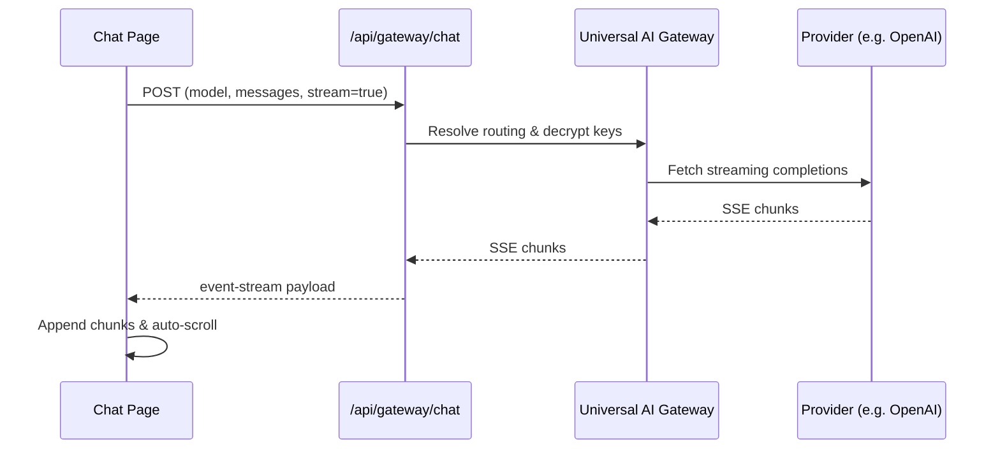

# Chat Platform Architecture

This document describes the design of the **Moataz AI Chat Platform**.

---

## 1. Data Flow & Streaming
Every chat session initializes a standard text-event-stream connection to our backend gateway:

---

## 2. Message History Retention
Messages are saved to the relational Postgres `messages` schema. For quick local sessions, we maintain the active array state in memory, allowing users to scroll and toggle immediately.
