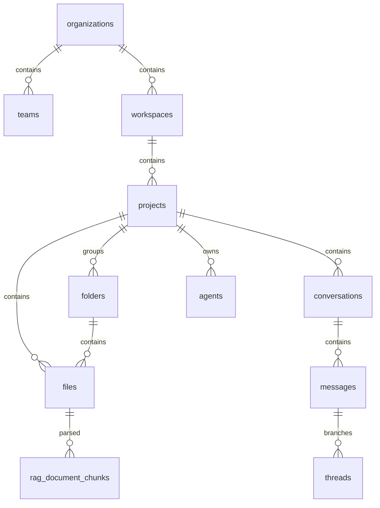

# Database Design Specification

This document details the normalized relational database architecture powering **Moataz AI**.

---

## 1. Schema Diagrams & Relationships
We use a normalized PostgreSQL schema enforcing strict multi-tenancy bounds:

---

## 2. Table Specifications

### users
Stores user accounts for authentication and workspace memberships.
- `id` (UUID, PK)
- `email` (VARCHAR, Unique)
- `full_name` (VARCHAR)
- `created_at` (TIMESTAMP)

### workspaces
Boundaries for project groups.
- `id` (UUID, PK)
- `organization_id` (UUID, FK)
- `name` (VARCHAR)
- `slug` (VARCHAR)

### projects
Bridges multi-tenant workspaces with files and chat histories.
- `id` (UUID, PK)
- `workspaceId` (UUID, FK)
- `name` (VARCHAR)
- `description` (TEXT)

---

## 3. Query Indexing Optimizations
All foreign keys have indexes created automatically:
- Index `idx_messages_conversation` speeds up loading chat history.
- Index `idx_files_project` accelerates project directory lookups.
- Index `idx_rag_chunks_file` speeds up context extraction in RAG loops.
