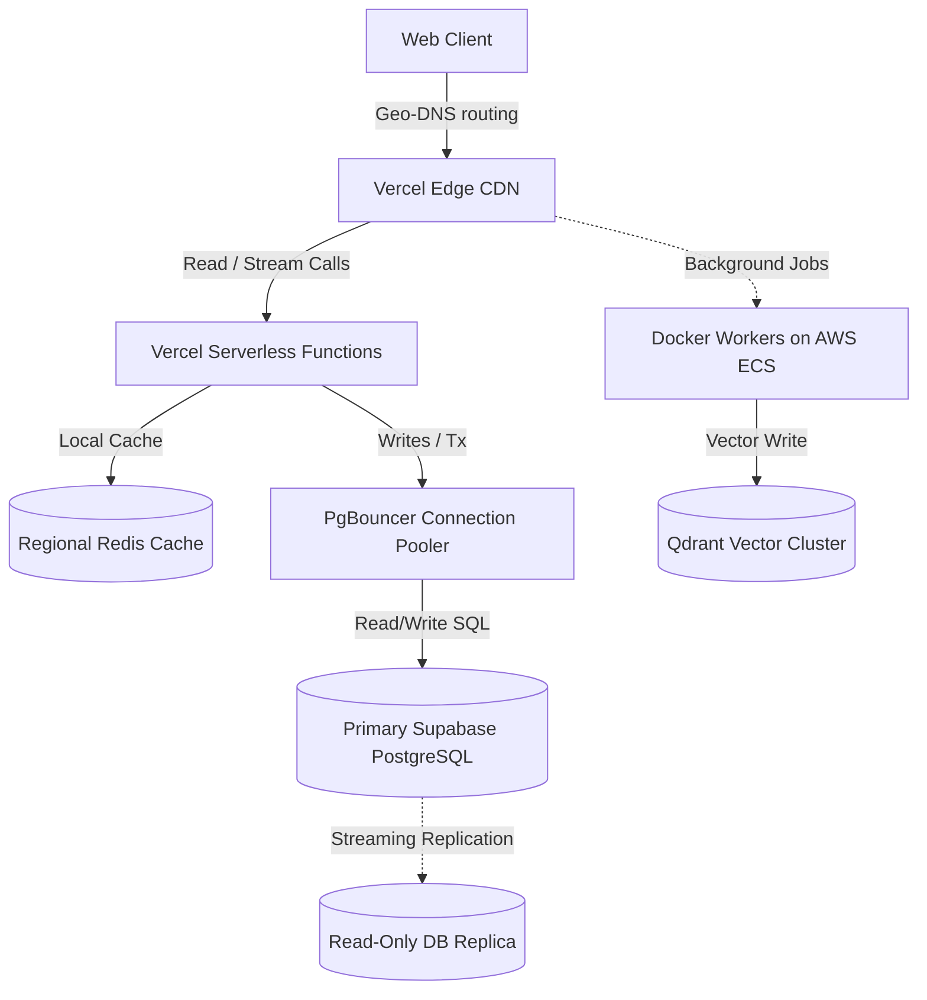

# Deployment & Infrastructure Architecture Blueprint

This document details the production deployment, container configurations, and CI/CD pipelines designed to run Moataz AI at scale.

---

## 1. High-Availability Multi-Region Topology

To guarantee low latency for international users, Moataz AI uses a geo-distributed hybrid cloud infrastructure:



### Components
1.  **Vercel Edge Network**: Renders components and streams route handlers near the client.
2.  **AWS ECS (Elastic Container Service)**: Hosts the BullMQ workers, Sandbox containers, and OCR file processing pipelines inside Docker containers.
3.  **Supabase PostgreSQL (Primary / Replica)**: Database engine with geo-replicated read replicas located near regional Vercel edge functions.

---

## 2. Connection Pooling & Database Scaling

Relational databases chokes under the stateless connection creations common to serverless environments (Next.js serverless functions).
*   **PgBouncer Integration**: We route all database queries through PgBouncer in **Transaction Mode**. This keeps active connection instances capped at 50, supporting up to 10,000 concurrent serverless requests.
*   **Vector Engine Replication**: The Qdrant Vector database is clustered with three nodes. Master nodes handle embedding index writes, while slave nodes handle semantic context retrievals.

---

## 3. GitHub Actions CI/CD GitOps Pipeline

All deployments are fully automated. Manual deployments to production are strictly blocked.

### Deployment Lifecycles
*   **Development Merge**: Pushing to the `develop` branch builds a preview deployment on Vercel and runs integration tests.
*   **Release Tagging**: Merging a release branch into `main` builds production images, triggers database migrations, and deploys to production Vercel.

### Pipeline Outline (`.github/workflows/deploy.yml`)

```yaml
name: Production Deployment Pipeline

on:
  push:
    branches: [ main ]

jobs:
  audit-quality-gates:
    runs-on: ubuntu-latest
    steps:
      - uses: actions/checkout@v4
      - name: Setup Node
        uses: actions/setup-node@v4
        with:
          node-version: '20'
          cache: 'npm'
      - name: Install Dependencies
        run: npm ci
      - name: Run Typecheck
        run: npm run typecheck
      - name: Run Lint
        run: npm run lint
      - name: Run Unit Tests
        run: npm run test:unit

  build-and-deploy:
    needs: audit-quality-gates
    runs-on: ubuntu-latest
    steps:
      - uses: actions/checkout@v4
      - name: Deploy to Vercel Production
        uses: amondnet/vercel-action@v20
        with:
          vercel-token: ${{ secrets.VERCEL_TOKEN }}
          vercel-org-id: ${{ secrets.VERCEL_ORG_ID }}
          vercel-project-id: ${{ secrets.VERCEL_PROJECT_ID }}
          vercel-args: '--prod'
```
