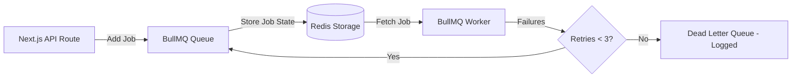

# Event & Queue Architecture Specification

This document details the event-driven system and background processing queues designed to decouple Moataz AI services.

---

## 1. Dual-Bus Event System

To ensure loose coupling, Moataz AI distinguishes between **Domain Events** (in-process events) and **Background Events** (cross-process messages).

```text
                     [ EVENT SYSTEM PIPELINE ]

                      Use Case Execution (Application)
                                  │
                   ┌──────────────┴──────────────┐
                   ▼                             ▼
             [ Domain Events ]           [ Background Events ]
             (In-Memory Bus)              (Redis PubSub Bus)
                   │                             │
         ┌─────────┴─────────┐         ┌─────────┴─────────┐
         ▼                   ▼         ▼                   ▼
    Audit Logger       State Cache  Email System     BullMQ Workers
```

### A. Domain Events (In-Memory Bus)
*   *Scope*: Transient state synchronizations running within the same execution loop.
*   *Framework*: Node.js `EventEmitter` wrapped in a type-safe interface.
*   *Example*: `UserAuthenticatedEvent` triggers an update to the user's cached activity timestamp.

### B. Background Events (Redis Pub/Sub Bus)
*   *Scope*: Cross-process messages distributed to worker microservices or background instances.
*   *Framework*: Redis Pub/Sub streams managed by an infrastructure adapter.
*   *Example*: `FileUploadedEvent` alerts the processing worker to download and scan the document.

---

## 2. Event Payload Schemas

Every event payload inherits from a base interface to guarantee auditable telemetry tracking:

```typescript
export interface IEventEnvelope<T = unknown> {
  eventId: string;
  eventName: string;
  timestamp: string;
  correlationId: string; // Tracks the trace across services
  actorId: string;
  payload: T;
}

// Example Event definition
export interface IFileUploadedPayload {
  fileId: string;
  ownerId: string;
  fileUrl: string;
  fileSize: number;
}
```

---

## 3. Queue Architecture (Redis + BullMQ)

Heavy background tasks (OCR extraction, text chunking, and embedding generation) must not run in the Next.js API Route web processes. Instead, they are offloaded to **BullMQ Workers** running on dedicated servers.



### Queue Configurations & Resilience

*   **Concurrency**: Workers configured to run up to 10 concurrent processes per container, depending on CPU availability.
*   **Job Scheduler**: Enforces cron schedules for platform tasks, such as key rotations or metrics aggregations.
*   **Retry Policy**:
    *   Exponential backoff logic is applied (backoff delay starting at `5000ms`).
*   **Dead Letter Queue (DLQ)**:
    *   If a job (like OCR processing of a corrupted PDF) fails 3 times consecutively, it is moved to the DLQ.
    *   The DLQ triggers an alert to Sentry and notifies the user with a "Processing failed" card.
