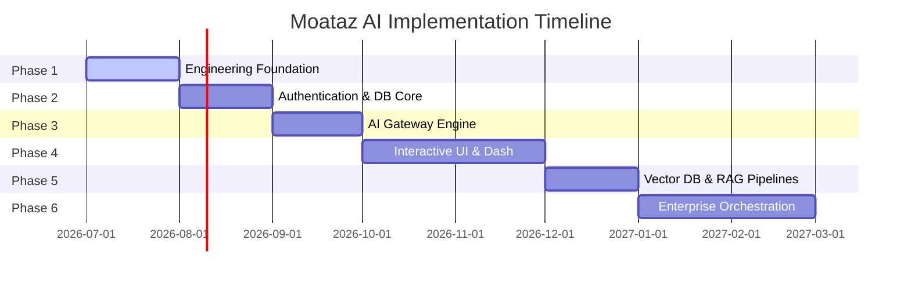

# Moataz AI — Product Roadmap & Risk Analysis

This document details the development milestones for subsequent implementation phases and logs the project risk management index compiled by our Principal Architects.

---

## 1. Multi-Phase Roadmap

### Phase 1: Engineering Foundation & Architecture Boundaries (Current)
*   **Deliverable**: Strict directory structures, configurations, design system tokens, path aliases, linting gates, and architectural specifications.
*   **Status**: Completed.

### Phase 2: User Authentication & Database Foundations
*   **Focus**: User identities, workspaces setup, permissions, and initial Postgres schema migrations.
*   **Key Tasks**: Set up Supabase Auth, write profiles tables, establish workspace ownership definitions, write audit log tables.

### Phase 3: AI Gateway Integration & API Credentials Custody
*   **Focus**: Symmetric API key encryption mechanisms and the unified provider interface.
*   **Key Tasks**: Implement AES-256-GCM decrypters, build the gateway factory, deploy OpenAI/Gemini/Anthropic adapters, write rate limiting middleware using Redis.

### Phase 4: Dynamic Chat Interface & Session Dashboard
*   **Focus**: React presentation layer rendering, real-time message streaming, and state synchronization.
*   **Key Tasks**: Build Chat Window components using Framer Motion, implement Next.js route handlers for HTTP Server-Sent Events (SSE), and hook up Zustand for transient conversation states.

### Phase 5: Knowledge Injection (Vector RAG Pipelines)
*   **Focus**: Document chunking, vector database index schemas, and similarity context inject engines.
*   **Key Tasks**: Integrate Qdrant database, establish embedding generation pipelines (using Gemini/OpenAI embedding models), write search utilities, and build context injection middleware.

### Phase 6: Enterprise Analytics, Billing, and Orchestration
*   **Focus**: Usage audits, multi-region scaling, Stripe billing integration, and advanced prompt template managers.

---

## 2. Architectural & Enterprise Risk Analysis

| # | Risk Area | Technical Description | Risk Level | Mitigation Strategy |
| :--- | :--- | :--- | :--- | :--- |
| **1** | **API Key Custody Leak** | Compromise of the primary Master Encryption Key leading to mass exposure of user keys. | **CRITICAL** | Store the Master Key strictly in cloud runtime environment variables (never committed to git or local configs). Implement strict Row-Level Security (RLS) on the Supabase credentials table. |
| **2** | **Provider Rate Limits** | High volume of users exhausting their own provider API keys, causing UI freezes and platform complaints. | **HIGH** | Implement middleware executing Redis sliding-window limiters. Standardize provider error headers (like `429 Too Many Requests`) into explicit, user-friendly UI banners. |
| **3** | **Streaming Buffer Bloat** | Real-time response streaming buffers choking on the server under high concurrent users. | **MEDIUM** | Use serverless-friendly Edge Functions (Vercel Edge) for the streaming routing engine to bypass typical node process threading limitations. |
| **4** | **Clean Architecture Over-Engineering** | Excessive boilerplate layers (mappers, value objects) slowing down feature development speeds. | **MEDIUM** | Keep entity properties lean. Shared utilities should handle pure formatters without wrapping them in complex domain services. |
| **5** | **Vector Database Latencies** | Dense index queries in Qdrant taking >500ms under high payload sizes. | **HIGH** | Implement caching for frequent semantic query hashes using Redis with a TTL of 30 minutes. Run background index optimizations on Qdrant during off-peak hours. |
| **6** | **RTL Layout Breaks** | Arabic translations breaking UI layouts due to absolute positioning or hardcoded values. | **MEDIUM** | Enforce Tailwind directional spacing classes (`ps-*`, `pe-*`, `start-*`, `end-*`) instead of legacy left/right classes (`pl-*`, `pr-*`). Run Automated visual regression tests for both English and Arabic views. |
| **7** | **Memory Leaks in Serverless** | DB connection pools exhausting in Next.js Serverless route handlers under high scale. | **HIGH** | Utilize connection pool managers (like Supabase Connection Pooler / PgBouncer) and enforce singleton prisma/pg connection client instances. |
