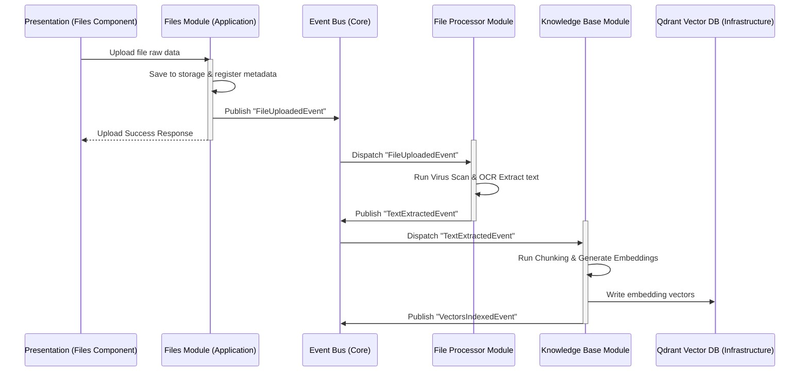

# System Design Blueprint: Core Platform Modules

This document details the functional responsibilities, contracts, and layer structures of the 22 Core Platform Modules in Moataz AI.

---

## 1. System Module Catalog

### 1. AI Gateway (`src/modules/ai-gateway`)
*   *Role*: Abstract routing router for LLM calls.
*   *Components*: Model registry, provider registry, streaming normalizer, fallback orchestrator, retry buffers, token counters.
*   *Database Bindings*: API credentials vault and token usage ledgers.

### 2. Chat (`src/modules/chat`)
*   *Role*: Chat sessions and messaging flow state.
*   *Components*: Chat history, dynamic SSE stream controllers, message schemas.
*   *Database Bindings*: `chat_sessions` and `chat_messages` relational tables.

### 3. Projects (`src/modules/projects`)
*   *Role*: Isolates resources (sessions, prompts, knowledge) into workspace boundaries.
*   *Components*: Project contexts, project preference metadata.
*   *Database Bindings*: `projects` configurations table.

### 4. Agents (`src/modules/agents`)
*   *Role*: Configures autonomous system loops.
*   *Components*: Agent prompts, tool assignments, system instructions, loop triggers.
*   *Database Bindings*: `agent_configurations` and `agent_run_logs` tables.

### 5. Memory (`src/modules/memory`)
*   *Role*: Long-term, short-term, and semantic user conversation memory.
*   *Components*: Sliding window session memories, summaries generators.
*   *Database Bindings*: Redis (short-term cache) and Supabase Postgres (archived logs).

### 6. Knowledge Base (`src/modules/knowledge-base`)
*   *Role*: Context ingestion storage.
*   *Components*: Chunking managers, embedding trigger ports.
*   *Database Bindings*: Qdrant vector collection mapping.

### 7. RAG (`src/modules/rag`)
*   *Role*: Retrieval-Augmented Generation context injection.
*   *Components*: Search queries formulators, semantic rankers, context aggregators.
*   *Database Bindings*: Qdrant vector read interfaces.

### 8. Sandbox (`src/modules/sandbox`)
*   *Role*: Isolated execution space for running agentic code blocks safely.
*   *Components*: Safe JS/Python interpreters, environment limits managers.
*   *Database Bindings*: None (runs inside isolated, stateless container pods).

### 9. Files (`src/modules/files`)
*   *Role*: Ingests and registers user uploads.
*   *Components*: Extension validators, metadata scrapers, pipeline dispatchers.
*   *Database Bindings*: Supabase Storage bucket pointers and `files` metadata registry.

### 10. Settings (`src/modules/settings`)
*   *Role*: Platform preferences controls.
*   *Components*: Multi-language catalogs selectors, theme hooks.
*   *Database Bindings*: `user_settings` configuration profiles.

### 11. Dashboard (`src/modules/dashboard`)
*   *Role*: Platform metrics, costs, and token consumption charts.
*   *Components*: Token cost estimators, active session trackers.
*   *Database Bindings*: Aggregate views of usage ledgers.

### 12. Providers (`src/modules/providers`)
*   *Role*: Manages active LLM provider configurations.
*   *Components*: Provider endpoints registries, ping diagnostics test.
*   *Database Bindings*: `providers` status configs.

### 13. API Keys (`src/modules/api-keys`)
*   *Role*: Manages user-supplied API keys safely.
*   *Components*: Key vault encryption hooks, keys rotating triggers.
*   *Database Bindings*: `api_keys_vault` encrypted columns.

### 14. Tools (`src/modules/tools`)
*   *Role*: Executable function schemas for Agent calling loops.
*   *Components*: JSON Schema generators, tools validation engine.
*   *Database Bindings*: `workspace_tools` definitions.

### 15. Workspace (`src/modules/workspace`)
*   *Role*: Multi-tenant tenant setups.
*   *Components*: Organizations mapping, team invitation managers.
*   *Database Bindings*: `organizations`, `teams`, `memberships` tables.

### 16. Plugins (`src/modules/plugins`)
*   *Role*: Integrates third-party app additions dynamically.
*   *Components*: Manifest parsers, lifecycle state managers.
*   *Database Bindings*: `installed_plugins` configuration registries.

### 17. Connectors (`src/modules/connectors`)
*   *Role*: Syncs data with Slack, GitHub, Google Drive.
*   *Components*: OAuth callback route handlers, sync triggers.
*   *Database Bindings*: `connector_credentials` vaults.

### 18. Monitoring (`src/modules/monitoring`)
*   *Role*: Infrastructure metrics collection.
*   *Components*: Prometheus exporter endpoints, health checks.
*   *Database Bindings*: None (scraped by Grafana/Prometheus).

### 19. Analytics (`src/modules/analytics`)
*   *Role*: Tracks user behavior and system performance.
*   *Components*: PostHog triggers, custom click/feature event tracers.
*   *Database Bindings*: None (pushed to cloud collector).

### 20. Storage (`src/modules/storage`)
*   *Role*: Asset storage bucket manager.
*   *Components*: Presigned URL generators, storage quotas controllers.
*   *Database Bindings*: Supabase Storage API adapters.

### 21. Notifications (`src/modules/notifications`)
*   *Role*: Alerts delivery engine.
*   *Components*: Email adapters, in-app SSE message pushers.
*   *Database Bindings*: `user_notifications` history table.

### 22. Authentication (Future)
*   *Role*: Manages identity and sessions.
*   *Components*: Supabase Auth mappings, JWT verifiers.
*   *Database Bindings*: Supabase Auth users.

### 23. Billing (Future)
*   *Role*: Stripe integrations and subscription tiers.
*   *Components*: Stripe webhook verification handlers, subscription limiters.
*   *Database Bindings*: `subscriptions` table.

---

## 2. Cross-Module Data Ingestion Pipeline

The diagram below shows how different modules coordinate to handle a file upload and inject it into the Project Brain RAG system.

*Notice: The decoupling achieved via the Event Bus keeps modules isolated. The Files module has no direct dependencies on Qdrant, OCR libraries, or embedding systems.*
